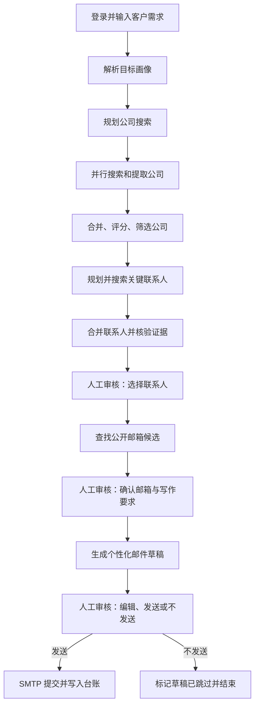
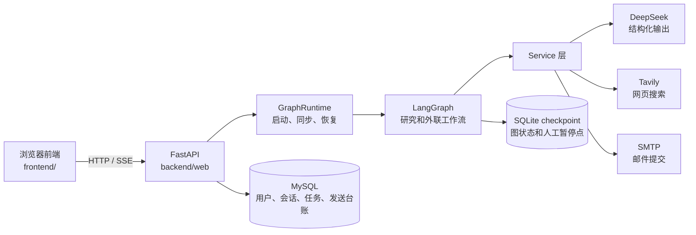

# LeadGraph

> 基于 LangGraph 的智能客户发现与外联工作台：把自然语言需求转化为目标公司与联系人，保留公开来源证据；经过人工确认后查询联系方式、生成邮件草稿，并在最终确认后通过 SMTP 提交邮件。


## 功能

- 账号登录、会话管理与按用户隔离的任务历史。
- 自然语言需求解析、公司发现、公司评分、联系人发现与证据补全。
- 搜索预算、缓存、重复请求合并、并发限制、超时与有限重试。
- 三次人工确认：选择联系人、确认邮箱与写作要求、审核邮件。
- 邮件草稿编辑、跳过发送、SMTP 提交与持久化防重台账。
- 图运行进度的 SSE 实时展示，以及 DeepSeek、Tavily 的共享账户额度展示。
- 无需密钥即可体验完整交互的演示模式。

## 完整业务流程



举例：用户输入“寻找英国乳制品加工企业的采购经理、工程经理或生产负责人”。程序先得到国家、行业和职位等结构化画像，再以有限的搜索计划找到候选公司；评分后才对合格公司寻找负责人。最终只有用户选中的人会进入邮箱搜索，只有用户确认的草稿才会进入邮件发送节点。

研究主图位于 [backend/graph/main_graph.py](backend/graph/main_graph.py)，人工审核和外联流程由 [backend/graph/outreach_graph.py](backend/graph/outreach_graph.py) 接入。

## 架构



| 存储 | 内容 | 用途 |
|---|---|---|
| MySQL | 用户、会话、任务展示数据、发送台账 | 登录、任务隔离、页面展示、发送记录 |
| SQLite checkpoint | 图状态、下一节点、`interrupt` 暂停位置 | 人工审核和任务中断后的恢复 |

每个任务 ID 同时也是 LangGraph 的 `thread_id`。恢复或备份时，应将 MySQL 任务数据与 SQLite checkpoint 一起处理。

## 目录

```text
leadgraph/
├── backend/
│   ├── config/       # 流程参数和配置读取
│   ├── graph/        # LangGraph 主图、子图、节点、状态、路由、提示词
│   ├── persistend/   # MySQL 仓库和 SQLite checkpoint
│   ├── service/      # 搜索、模型、邮件、认证、额度服务
│   ├── web/          # FastAPI、登录接口、GraphRuntime
│   └── manage.py     # 初始化数据库、检查连接、创建账号
├── frontend/         # 前端页面、样式和浏览器端交互
├── deploy/           # Caddy 配置和服务器环境初始化脚本
├── docs/             # 本地账号与服务器部署补充文档
├── examples/         # 演示模式数据与流程
├── sql/              # 创建数据库 SQL
├── tests/            # 自动化测试
├── compose.yaml      # Docker Compose 编排
└── Dockerfile        # 应用镜像构建文件
```

## 模式

| 模式 | 适用场景 | 是否调用真实服务 |
|---|---|---|
| 演示模式 `demo` | 熟悉页面、审核和邮件流程 | 不调用 DeepSeek、Tavily 或真实 SMTP |
| 真实模式 | 真实客户研究和外联 | 需要 DeepSeek、Tavily；发送还需要 SMTP |

演示模式的联系人、邮箱、进度与邮件结果均为虚构或模拟数据，不能当作真实搜索结果或 API 消耗。

## Docker Compose 快速开始（推荐）

适用于 Linux 服务器，或已安装 Docker Desktop 的本机。需要 Docker Engine 和 Docker Compose v2。

### 1. 生成服务器配置

在项目根目录执行：

```bash
python3 deploy/init_env.py
```

输入服务器公网 IPv4。脚本会生成根目录 `.env`，并写入随机 MySQL 密码。这个文件包含密钥和密码，不能提交、上传或截图。

根目录 `.env` 服务于 Docker Compose，和本地开发的 `backend/config/.env` 是两份不同的配置文件。

### 2. 构建与启动

```bash
docker compose config -q
docker compose pull mysql caddy
docker compose build app
docker compose up -d
docker compose ps
```

Compose 会依次启动 MySQL、应用和 Caddy。检查状态：

```bash
docker compose logs --tail=60 mysql app caddy
curl http://127.0.0.1/healthz
```

健康检查返回 `{"status":"ok"}` 表示应用及业务数据库可用。

### 3. 创建网站账号

生产 Compose 默认关闭公开注册。通过容器创建账号，密码只在终端交互输入：

```bash
docker compose exec app python -m backend.manage create-user --username your_name
```

然后访问：

```text
http://服务器公网IP
```

若只供自己使用，建议先通过 SSH 隧道访问，避免使用公网 HTTP 提交登录信息：

```powershell
ssh -N -L 18080:127.0.0.1:80 登录用户名@服务器公网IP
```

浏览器打开 `http://127.0.0.1:18080`。

### 4. 开启真实研究和发送

先用演示模式验证部署。然后编辑根目录 `.env`：

```dotenv
DEEPSEEK_API_KEY=
TAVILY_API_KEY=
SMTP_HOST=
SMTP_PORT=465
SMTP_SECURITY=ssl
SMTP_USERNAME=
SMTP_PASSWORD=
SMTP_FROM=
```

修改环境变量后重新创建应用容器：

```bash
docker compose up -d app
```

`docker compose restart` 不会让已有容器加载新的环境变量。

### 5. 日常停止和更新

```bash
docker compose down
docker compose build app
docker compose up -d app
```

不要把 `docker compose down -v` 当作日常停止命令；它会删除 MySQL 和 checkpoint 数据卷。

## 本地开发

需要 Python 3.12 和 MySQL 8.x。

### 1. 安装依赖

```powershell
python -m pip install -r backend/requirements-lock.txt
```

已有旧环境时，也可只补充账户依赖：

```powershell
python -m pip install -r requirements-accounts.txt
```

### 2. 初始化 MySQL

先用 MySQL 管理员账号执行 [sql/create_database.sql](sql/create_database.sql)，再创建应用账号：

```sql
CREATE USER 'leadgraph_app'@'localhost' IDENTIFIED BY '替换为强密码';
GRANT SELECT, INSERT, UPDATE, DELETE, CREATE, INDEX, REFERENCES
ON leadgraph.* TO 'leadgraph_app'@'localhost';
```

### 3. 创建 `backend/config/.env`

不要提交该文件。最小本地配置如下：

```dotenv
MYSQL_HOST=127.0.0.1
MYSQL_PORT=3306
MYSQL_DATABASE=leadgraph
MYSQL_USER=leadgraph_app
MYSQL_PASSWORD="你的本机强密码"

ALLOW_REGISTRATION=true
SESSION_COOKIE_SECURE=false
LEADGRAPH_CHECKPOINT_DB=data/checkpoints.sqlite3

DEEPSEEK_API_KEY=
TAVILY_API_KEY=
SMTP_HOST=
SMTP_PORT=465
SMTP_SECURITY=ssl
SMTP_USERNAME=
SMTP_PASSWORD=
SMTP_FROM=
```

### 4. 初始化并运行

```powershell
python -m backend.manage init-db
python -m backend.manage check-db
python -m backend.web
```

打开 `http://127.0.0.1:8080`。关闭网页注册时，可以命令行创建账号：

```powershell
python -m backend.manage create-user --username your_name
```

本地账号、数据库、额度和 checkpoint 的详细说明见 [docs/ACCOUNT_SETUP.md](docs/ACCOUNT_SETUP.md)。

## 配置

### 环境变量

| 变量 | 用途 | 说明 |
|---|---|---|
| `DEEPSEEK_API_KEY` | DeepSeek 密钥 | 真实研究与邮件写作需要 |
| `DEEPSEEK_MODEL` | 模型名称 | 默认 `deepseek-v4-flash` |
| `TAVILY_API_KEY` | Tavily 密钥 | 公司、人员和联系方式搜索需要 |
| `TAVILY_TOOL_NAME` | MCP 工具名称 | 工具名不唯一时指定 |
| `SMTP_*` | SMTP 配置 | 真实发送需要；常用 SSL 端口为 465 |
| `MYSQL_*` | MySQL 连接 | 用户、会话、任务与台账 |
| `LEADGRAPH_CHECKPOINT_DB` | checkpoint 路径 | 保存图状态与人工暂停点 |
| `ALLOW_REGISTRATION` | 是否允许网页注册 | 生产建议 `false` |
| `SESSION_COOKIE_SECURE` | Cookie 是否仅 HTTPS | HTTPS 环境设为 `true` |
| `LEADGRAPH_ALLOWED_HOSTS` | 允许的域名/IP | 不要填写协议或路径 |
| `LEADGRAPH_MAX_ACTIVE_RUNS` | 并行研究任务数 | 当前允许 1–3；低内存机器建议 1 |

### 研究参数

参数在 [backend/config/config.ini](backend/config/config.ini)。

| 参数 | 默认值 | 含义 |
|---|---:|---|
| `max_company_searches` | 4 | 公司搜索任务上限 |
| `max_companies` | 8 | 进入人员规划的公司数 |
| `max_person_searches_per_company` | 2 | 每家公司人员搜索任务上限 |
| `max_leads_to_enrich` | 10 | 进入补全阶段的人数 |
| `max_enrichment_searches` | 2 | 每人最多新增补搜次数 |
| `max_search_calls` | 40 | 每次研究的提供者调用尝试，包含重试 |
| `search_concurrency` | 4 | 同时进行的搜索数 |
| `llm_concurrency` | 4 | 同时进行的模型调用数 |
| `timeout_seconds` | 60 | 单次调用超时秒数 |
| `search_attempts` / `llm_attempts` | 2 | 总尝试次数，包含首次 |
| `cache_ttl_seconds` | 900 | 成功搜索的内存缓存秒数 |

`max_search_calls` 是程序内部调用尝试预算，不能直接当作 Tavily credits，也不涵盖联系方式阶段使用的独立搜索服务。

## 人工审核和邮件规则

| 审核阶段 | 用户确认的内容 | 后续动作 |
|---|---|---|
| 联系人审核 | 哪些人值得继续联系 | 仅查询这些人的公开联系方式 |
| 邮箱审核 | 邮箱归属、邮件语言、语气、关键词与署名 | 生成草稿 |
| 邮件审核 | 草稿最终版本 | 发送、继续编辑，或不发送结束 |

关键边界：

- 搜到邮箱只表示“公开候选地址”，不证明属于本人，仍须人工确认。
- 模型生成草稿，不具备直接发送权限。
- 发送前校验草稿版本和内容摘要，避免审核后内容被替换。
- SMTP 明确拒绝时记为 `failed`；提交后发生网络中断等不确定结果记为 `unknown`，系统不会自动重发。
- `sent` 表示 SMTP 接受提交，不表示对方已阅读或保证进入收件箱。
- “不发送”只关闭仍为 `draft` 的草稿，已提交邮件无法撤回。

## 运行进度、恢复和异常

节点开始时会产生进度事件，前端使用 SSE 实时展示。图状态使用 SQLite checkpoint 保存：

```text
应用重启或后台任务中断
    ↓
读取 checkpoint
    ↓
人工审核中：必须通过当前审核页面 Command(resume=...) 继续
未完成且不在审核中：从已保存的下一节点继续
```

部分公司评分、人员补全失败时，其他并行任务仍可完成，研究结果可能为 `partial`；目标解析、公司规划等关键步骤失败时，流程会收尾并给出失败摘要。

## 接口概览

前端使用以下主要接口，默认均受登录会话、同源与 CSRF 校验保护：

| 方法 | 路径 | 作用 |
|---|---|---|
| `GET` | `/api/session` | 当前登录、SMTP 和研究配置状态 |
| `GET` | `/api/usage` | DeepSeek 与 Tavily 额度 |
| `GET` / `POST` | `/api/runs` | 任务历史与创建研究 |
| `GET` | `/api/runs/{id}` | 单次任务详情 |
| `GET` | `/api/runs/{id}/events` | SSE 进度流 |
| `POST` | `/api/runs/{id}/contacts` | 选择联系人并开始查邮箱 |
| `PATCH` | `/api/runs/{id}/contacts/{lead_id}` | 确认或手动填写邮箱 |
| `POST` | `/api/runs/{id}/drafts` | 提交写作要求并生成草稿 |
| `PATCH` | `/api/runs/{id}/drafts/{draft_id}` | 编辑草稿 |
| `POST` | `/api/runs/{id}/send` | 审核后发送 |
| `POST` | `/api/runs/{id}/skip-send` | 不发送并结束 |
| `POST` | `/api/runs/{id}/continue` | 恢复非人工审核状态的中断任务 |

## 测试

在项目根目录运行：

```powershell
python -m pytest tests -q
```

测试覆盖工作流、搜索预算、模型结构、人工审核、邮件防重、账号隔离、额度查询与 Compose 配置。测试可能使用假的搜索、模型、SMTP 与数据库，因此通过测试不等于真实 API、真实 MySQL 或真实 SMTP 已完成联调。

## 常见问题

### 能登录，但真实研究没有进展

检查 `DEEPSEEK_API_KEY` 与 `TAVILY_API_KEY` 是否已加载。Docker 环境变量修改后：

```bash
docker compose up -d app
docker compose logs --tail=100 app
```

### 人工审核显示没有联系人

依次检查：`finalize` 是否有 `results`、`prepare_review` 是否返回 `review_leads`、`GraphRuntime.sync()` 是否将其投影为页面 `leads`，以及当前用户是否拥有该任务。

### 邮件无法发送

确认 SMTP 配置完整、邮箱已人工确认、草稿版本未过期、`SMTP_FROM` 没有变化，以及服务器允许访问所用 SMTP 端口。

### 服务重启后任务状态不一致

确认 MySQL 任务记录和 SQLite checkpoint 都还在。不要只复制联系人、草稿或页面数据来恢复任务；图状态、人工审核位置和发送台账需要成组处理。

## 安全与使用建议

- `.env`、数据库密码、SMTP 授权码和 API Key 只保留在部署机器；仓库已忽略它们。
- 公网部署请配置 HTTPS，并设置 `SESSION_COOKIE_SECURE=true` 和明确的 `LEADGRAPH_ALLOWED_HOSTS`。
- 生产环境建议关闭公开注册，通过 `backend.manage create-user` 创建账号。
- 不要自动联系未确认的邮箱；应核对公开来源、联系人身份、联系偏好与适用规则。
- 小内存服务器优先降低 `search_concurrency`、`llm_concurrency` 和 `LEADGRAPH_MAX_ACTIVE_RUNS`。
- 定期备份 MySQL 与 checkpoint；`unknown` 邮件结果需人工检查发件记录。

## 技术栈

- Python 3.12、FastAPI、Uvicorn
- LangGraph、LangChain、DeepSeek 结构化输出
- Tavily MCP 搜索
- MySQL 8、SQLAlchemy、PyMySQL
- SQLite、LangGraph AsyncSqliteSaver
- Argon2、HttpOnly Cookie、CSRF 校验
- SMTP / SSL / STARTTLS
- 原生 HTML、CSS、JavaScript、SSE
- Docker Compose、Caddy

## 相关文档

- [本地账号、MySQL、额度与 checkpoint](docs/ACCOUNT_SETUP.md)
- [Alibaba Cloud Linux / Docker Compose 部署](docs/SERVER_DEPLOY.md)
- [完整学习文档与代码解析包](LeadGraph-完整学习文档-含代码全量解析.zip)
